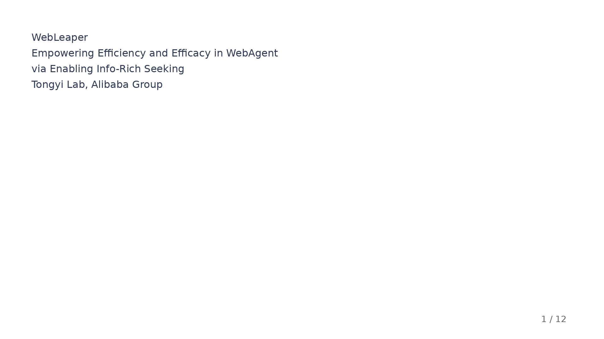
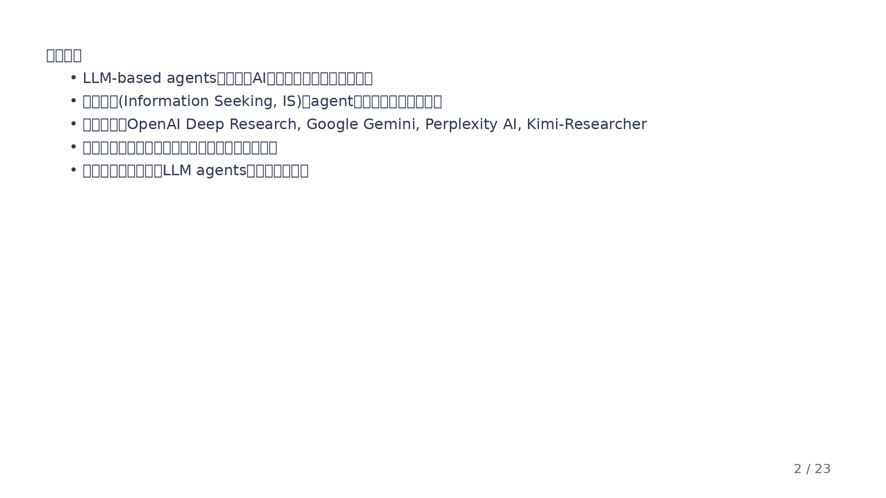
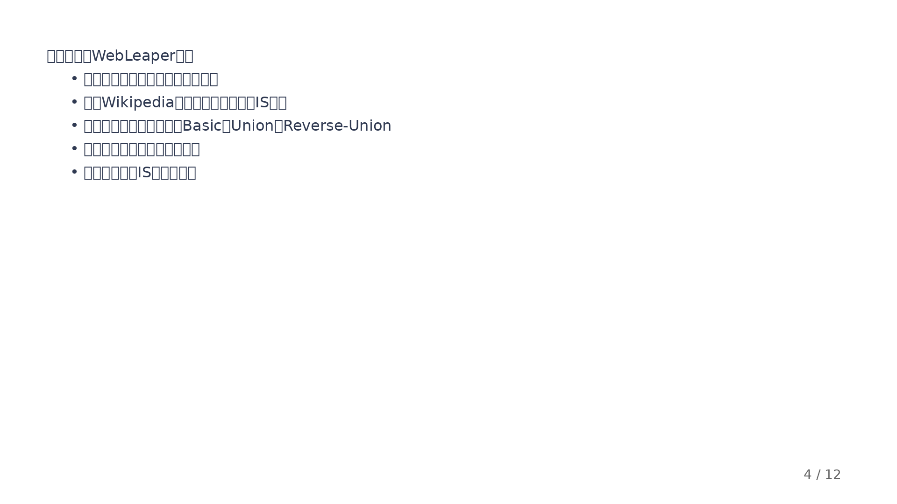
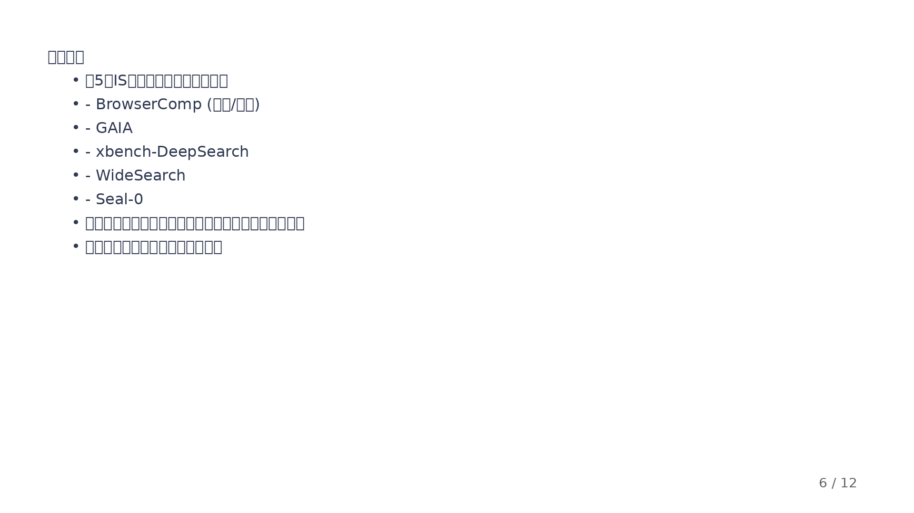
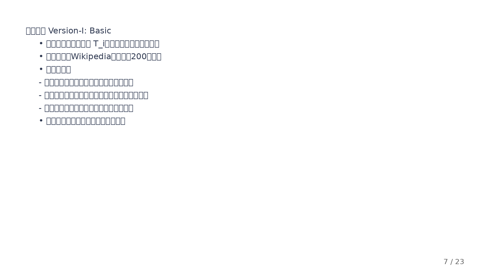
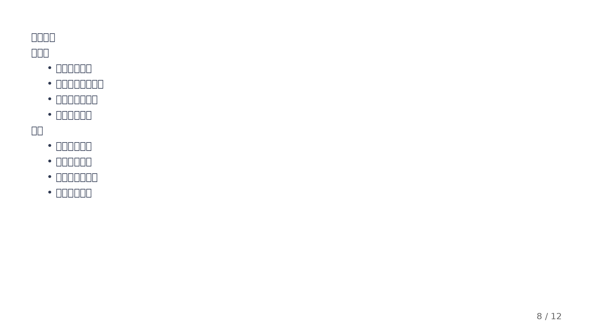
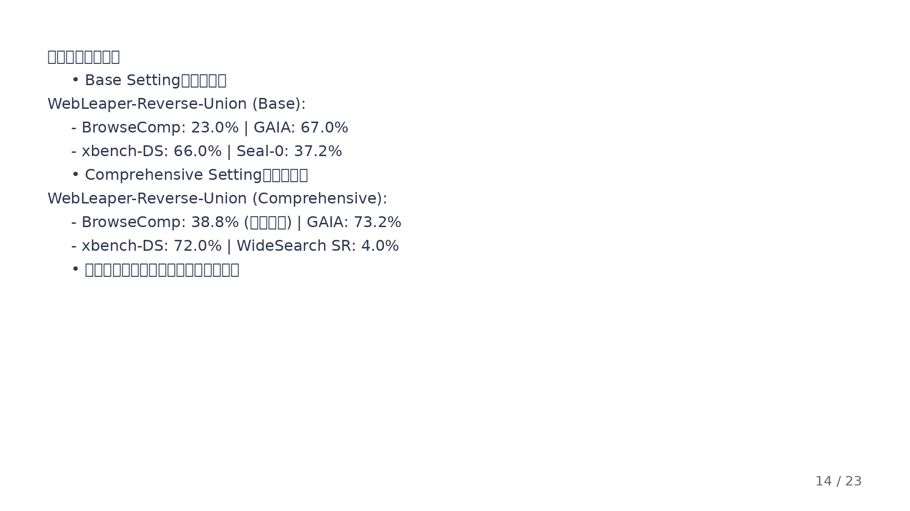
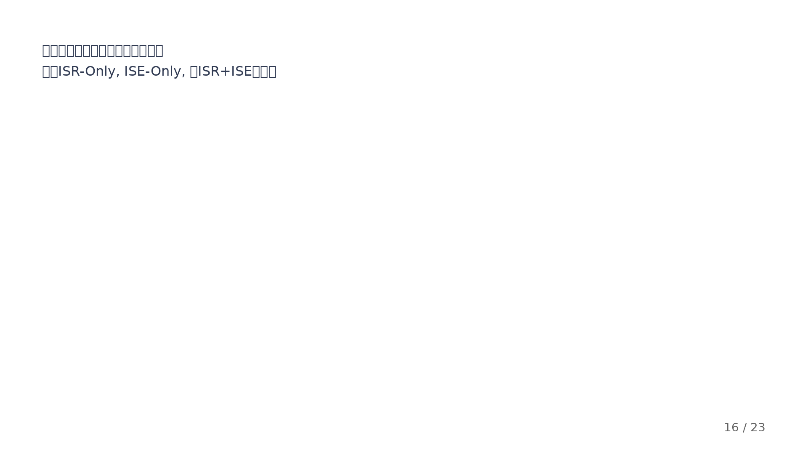
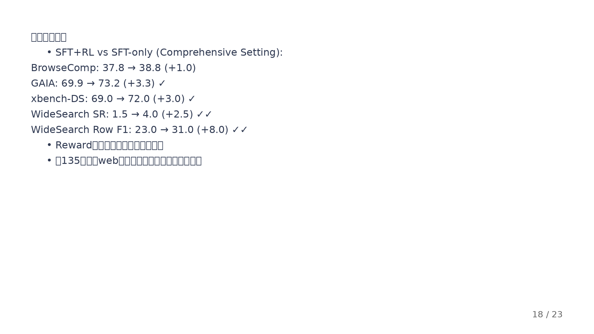

# WebLeaper 专业组会展示 PPT 截图

本文件夹包含了 **WebLeaper** 专业组会展示PPT的所有23张幻灯片截图。

> **注意**: 由于技术限制，当前截图只包含文本内容。完整的PPT文件（包含所有图表和图片）请直接打开 **[WebLeaper专业组会展示.pptx](../WebLeaper专业组会展示.pptx)** 查看。

## 📊 完整PPT包含的图表

PPT中嵌入了以下论文核心图表（PNG格式，高清）：

1. **第4页**: infogain_cover_rate_kde.png - 有效动作分布图
2. **第6页**: overview.png - WebLeaper方法概览（展示Basic/Union/Reverse-Union三种方法）
3. **第13页**: main_results.png - 主要实验结果对比图
4. **第16页**: traj_ablation_bar_plot.png - 轨迹构造消融实验柱状图
5. **第17页**: tool_call_performance_scatter.png - 效率与效果散点图
6. **第19页**: reward_curve_compact.png - 强化学习训练曲线

所有原始图表可在 [figures_png/](../figures_png/) 文件夹中查看。

---

## 📄 幻灯片文本内容预览

### 第1页：标题页

- **WebLeaper**
- Empowering Efficiency and Efficacy in WebAgent via Enabling Info-Rich Seeking
- Tongyi Lab, Alibaba Group

---

### 第2页：研究背景

- LLM-based agents正在变革AI领域
- 信息搜索是自主推理的核心能力
- 商业系统：OpenAI Deep Research, Google Gemini等
- 现有研究主要关注搜索深度，较少关注搜索效率

---

### 第3页：核心问题 - 低搜索效率

- 问题现象：有效动作分布峰值约0.04
- 低效行为：冗余查询、不相关信息、过长搜索链
- 根本原因：训练任务中目标实体过于稀疏

---

### 第4页：有效动作分布图 📊

**包含图表**: infogain_cover_rate_kde.png
- 展示基于GPT模型在合成IS任务上的有效动作分布

---

### 第5页：解决方案 - WebLeaper框架

- 目标1：构建包含更多目标实体的新IS任务
- 目标2：生成准确且高效的解决轨迹
- 核心创新：树状推理、三种数据集变体、ISR/ISE指标、混合奖励系统

---

### 第6页：WebLeaper方法概览 📊

**包含图表**: overview.png（论文核心图）
- (a) Basic: 单一信息源
- (b) Union: 多源融合
- (c) Reverse-Union: 反向推理

---

### 第7页：Version-I - Basic

- 推理结构：树状结构T_i
- 数据来源：Wikipedia表格（约200万个）
- 三层结构：根节点、第二层实体、第三层属性

---

### 第8页：Version-II - Union

- 动机：提高结构复杂度，跨越多个信息源
- 方法：合并具有相似主题的推理子树
- 建模：最大二分团枚举

---

### 第9页：Version-III - Reverse-Union

- 动机：防止简单的关键词搜索捷径
- Deductive Fuzz：提供模糊线索
- Union-based Search：使用锚点启动新搜索

---

### 第10页：信息引导的轨迹构造

- 工具配置：Search、Visit
- 过滤准则：Coverage Criterion (ISR > α)、Efficiency Criterion (ISE > β)

---

### 第11页：混合奖励系统与强化学习

- 挑战：二元奖励稀疏、精确匹配脆弱、LLM-as-Judge成本高
- Hybrid Reward System：F-score细粒度奖励
- 优化算法：GRPO

---

### 第12页：实验设置

- 评估基准：BrowseComp, GAIA, xbench-DeepSearch, Seal-0, WideSearch
- 基线模型：商用（Claude-4, OpenAI-o3）+ 开源（10+模型）
- Base模型：Qwen3-30B-A3B-Thinking-2507

---

### 第13页：主要实验结果图 📊

**包含图表**: main_results.png
- 综合训练设置下的完整结果对比

---

### 第14页：详细实验结果对比

- Base Setting和Comprehensive Setting的关键结果
- WebLeaper-Reverse-Union达到最佳性能

---

### 第15页：消融实验

- Basic-5k: 平均-7.64（任务过简单）
- Union-5k: 平均+3.26 ✓
- Reverse-Union-10k: 平均+4.34 ✓✓

---

### 第16页：轨迹构造消融图 📊

**包含图表**: traj_ablation_bar_plot.png
- 对比ISR-Only, ISE-Only, ISR+ISE的效果

---

### 第17页：效率与效果的联合提升 📊

**包含图表**: tool_call_performance_scatter.png
- WebLeaper在效果和效率上均优于WebSailor-V2

---

### 第18页：强化学习结果

- SFT+RL vs SFT-only的详细对比
- 所有benchmark均有显著提升

---

### 第19页：RL训练曲线 📊

**包含图表**: reward_curve_compact.png
- 混合奖励系统的稳定训练曲线

---

### 第20页：主要贡献与创新

- 树状推理建模
- 三种任务合成变体
- ISR/ISE指标
- 混合奖励系统
- 5个benchmark验证

---

### 第21页：数据集统计

- Wikipedia数据：约200万表格
- 合成任务：Basic 5k, Union 5k, Reverse-Union 10k
- 训练配置：ISR α=0.3, ISE β=0.1

---

### 第22页：总结

- WebLeaper成功解决搜索效率低的问题
- 实验验证效率和效果的显著提升
- 成为当前最佳开源信息搜索agent

---

### 第23页：Q & A

- 谢谢！
- Q & A

---

## 📝 查看完整PPT

要查看包含所有图表和完整格式的PPT，请：

1. **下载完整PPT**: [WebLeaper专业组会展示.pptx](../WebLeaper专业组会展示.pptx)
2. **查看图表原图**: [figures_png/](../figures_png/) 文件夹
3. **在线预览**: 在GitHub上可以直接点击上方的图片链接查看每页内容

## 🎯 PPT特色

- ✅ 23页专业内容
- ✅ 6张论文核心图表（高清PNG）
- ✅ 完整的方法论讲解
- ✅ 详细的实验结果和数据
- ✅ 消融实验和RL训练分析
- ✅ 专业配色和排版
